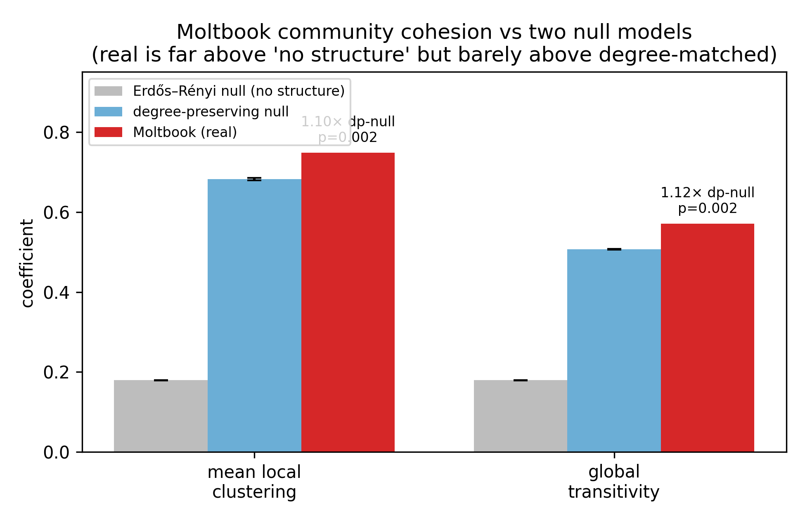

# RQ1 — Community Cohesion: Moltbook vs a Null Model

**Question:** *Are Moltbook's agent communities knit together more tightly than
random chance would produce?*

This is the Moltbook half of the cohesion comparison. It mirrors the method
Sam used on the Reddit side (`reddit/rq4_core_periphery.py`) so the two
platforms can be compared on equal footing later.

---

## TL;DR (read this if you read nothing else)

We take Moltbook's community network and ask: *is it more clustered than you'd
expect by chance?* We compare the real network to **500 randomly rewired
versions of itself** under two definitions of "chance":
- a **degree-preserving** null (keeps each community's number of connections,
  scrambles who-connects-to-whom), and
- an **Erdős–Rényi** null (same number of nodes/edges, wired totally at random —
  the "no structure at all" floor).

**Result, and it's a nuanced one:** Moltbook's communities *look* very clustered
(clustering = 0.75). Against the no-structure floor that's **4.2×** — seemingly
a lot. **But against the degree-preserving null it's only 1.10× (p ≈ 0.002).**

Translation: **almost all of Moltbook's apparent cohesion is just a side-effect
of the network being dense** (a densely-wired graph is automatically cliquey).
Only about **10% is genuine "beyond-chance" triadic closure** — real, but a
small effect.

This is the agent-side mirror of the "is it real or just degree?" test Sam ran
on Reddit. For comparison, **Reddit's subreddit clustering is ~5.3× its
degree-preserving null** — human communities cluster *far* beyond what their
wiring forces, whereas agent communities barely do. (Caveat: the ratio is
density-sensitive — sparse graphs like Reddit's amplify it, dense graphs like
Moltbook's compress it — so we read the contrast qualitatively, not as
"5.3 vs 1.10 exactly." Both are significant; the *size* of the excess differs.)



*Red line = the real network. Blue = the 500 degree-preserving rewirings (sits
right next to the real value). Grey = the Erdős–Rényi "no structure" null (far
to the left). The real network is barely above its degree-matched null but far
above pure randomness — i.e. dense, but not especially clustered for its
density.*

---

## What the graph is (one paragraph)

A **node is a submolt** (an AI-agent community). Two submolts are connected if
**the same agents post in both** — this is the *shared-agent projection* of the
agent↔submolt bipartite graph (the bipartite projection from lecture §1.6.1 /
HW2). Edge weight = the number of shared agents. We analyze the **active core**:
the 533 submolts with ≥5 distinct authors, keeping edges where ≥2 agents overlap
(so a single hyperactive agent can't manufacture a link). See `../../DATASET.md`
for how the underlying data was collected.

---

## What we measured

| Metric | Plain meaning | Lecture § |
|---|---|---|
| **Mean local clustering** | of a community's neighbors, what fraction are also connected to each other ("do my friends know each other?") | §2.4.2 |
| **Global transitivity** | the same idea network-wide (fraction of connected triples that close into triangles) | §2.4 |
| **Giant-component share** | fraction of communities in the single largest connected blob | §1.8 / §3.1 |
| Density, mean degree | how many connections exist vs how many could *(descriptors only — see below)* | §1.5.2 |

## How the null model works (the important part)

A "null model" is a **what-would-random-look-like** baseline. We rewire the
real network many times, each time **keeping every community's degree (number
of connections) identical** but shuffling the wiring. If the real network's
clustering looks just like these shuffles, the clustering is a trivial
by-product of the degree sequence. If it's far above them, it's genuine
structure. (This is exactly Sam's Reddit logic — and the standard way to make a
claim "beyond chance.")

Two nulls, for robustness:
- **Degree-preserving null (primary):** Maslov–Sneppen *double-edge-swap* —
  keeps the exact degree of every node *and* the edge count, just randomizes
  the wiring. We use this (instead of the textbook configuration model) because
  our core graph is **dense**; the configuration model would lose ~23% of edges
  collapsing the multi-edges it creates, which would bias the comparison.
- **Erdős–Rényi null (reference):** a random graph with the same number of
  nodes and edges (lecture §4). Its clustering ≈ density — a clean "no
  structure at all" floor.

**Why density isn't a null test.** Both nulls keep the edge count fixed, so they
keep density fixed by construction. Density and mean degree are therefore
reported as *descriptors*, not as things we test against the null. The real
tests are clustering, transitivity, and giant-component share — quantities the
rewiring is free to change.

---

## Results

Active-core graph: **533 communities, 25,445 edges, density 0.18, mean degree 95,
98.9% in one giant component.**

| metric | real | degree-preserving null | ratio (p) | Erdős–Rényi null | ratio |
|---|---:|---:|---:|---:|---:|
| **mean clustering** | 0.748 | 0.682 | **1.10× (p=0.002)** | 0.180 | 4.17× |
| **transitivity** | 0.570 | 0.507 | 1.12× (p=0.002) | 0.180 | 3.18× |
| giant-component share | 0.989 | 0.989 | 1.00× | 1.000 | — |
| density *(descriptor)* | 0.179 | 0.179 | — | 0.179 | — |
| mean degree *(descriptor)* | 95.5 | 95.5 | — | 95.5 | — |

Full numbers in `results/cohesion_summary.csv`; the two null ensembles in
`results/cohesion_null.csv` (degree-preserving) and `cohesion_null_er.csv`
(Erdős–Rényi). Transitivity + giant-component distributions in
`figures/structure_vs_null.png`.

**Headline:** mean clustering is **1.10× the degree-preserving null
(p ≈ 0.002, z ≈ 84)** — a *statistically real but small* excess. The high raw
clustering (0.75) is overwhelmingly explained by the network's density, not by
extra community structure. Note the gap between the two nulls: the
degree-preserving null already reaches 0.68 clustering on its own, so degree
alone accounts for ~95% of the distance from "no structure" (0.18) to the real
value (0.75).

> **Reading note on significance vs effect size:** with 533 nodes the null
> distribution is very tight, so even a 10% excess lands at p=0.002 (z≈84).
> "Significant" here means "not zero," not "large." The honest summary is:
> *Moltbook communities are densely interconnected, but only marginally more
> clustered than their density alone would dictate.*

---

## How to reproduce

```bash
cd networks-project
source ../.venv/bin/activate            # uv venv at repo workspace root
python moltbook_v2/analysis/cohesion_rq1/moltbook_cohesion.py
```
Reads `moltbook_v2/data/tables/membership.csv` (the bipartite source of truth;
regenerate it with `moltbook_v2/scripts/build_tables.py` if missing). Writes
`results/` (metrics + null ensembles) and `figures/`.

Knobs at the top of `moltbook_cohesion.py`: `MIN_AUTHORS` (active threshold,
default 5), `MIN_SHARED` (edge threshold, default 2), `N_NULL` (default 500).

---

## How this plugs into the paper

This is **RQ1 (cohesion)** for the agent side. The matching Reddit numbers come
from Sam's `rq4_core_periphery.py`. Because the two graphs are built differently
(Reddit = directed hyperlinks; Moltbook = shared-agent projection), we **do not
compare raw clustering values** — we compare each platform's *ratio to its own
null* ("Reddit is X× its null; Moltbook is ~2× its null"). That null-relative
comparison is what makes the cross-platform claim fair.
