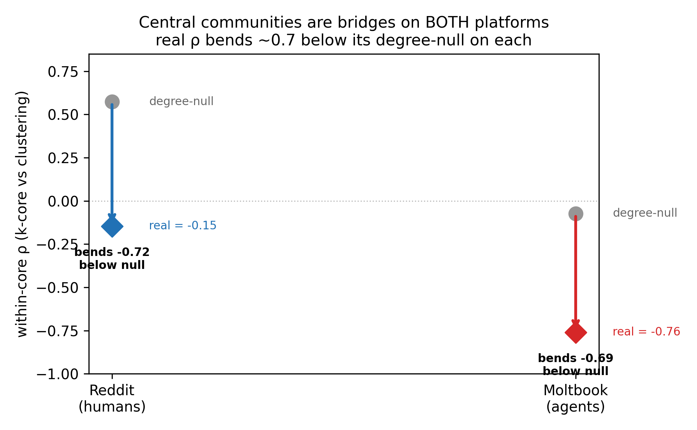

# RQ3 — Core-Periphery: Are Central Agent Communities Bridges or Cliques?

**Research question.** On Reddit, Sam found that a subreddit's *global position*
predicts its *local behavior*: the more globally embedded a community is (high
k-core), the **less** locally clustered it is — central communities act as
**bridges** between groups, while peripheral communities sit in tight cliques.
**Do AI-agent communities (Moltbook) show the same core-periphery organization?**

This branch applies Sam's Reddit method (`reddit/rq4_core_periphery.py`) to the
Moltbook community network, so the two platforms can be set side by side.

---

## Abstract (for the team)

We test whether Moltbook's agent communities are organized into a bridging core
and a cliquey periphery, the pattern Sam documented on Reddit. For each community
we compute its **k-core number** (global embeddedness) and its **local clustering
coefficient** (local cohesion), and measure their Spearman correlation — both
across the whole graph and within the connected core (k-core ≥ 2). We assess
significance against a degree-preserving **configuration-model null** (Sam's exact
inferential tool). To make the comparison fair we run this on the **full**
Moltbook community graph (all submolts, periphery included), which — unlike the
dense active-core graph used for the cohesion test — carries the leaf fringe that
makes it the structural analogue of Reddit's sparse subreddit graph. We find that
Moltbook reproduces Reddit's two-layer signature: a mechanically positive
full-graph correlation (dragged up by leaf communities) and a **negative
within-core correlation** — central agent communities are bridges, not cliques.
We report whether this survives the null, and how its null-relative strength
compares to Reddit's.

---

## TL;DR (30-second version)

- **k-core** = how deep inside the network a community sits (a high k-core means
  it belongs to a densely interconnected group). **Clustering** = how cliquey its
  own neighborhood is.
- **The question:** as communities get more central (higher k-core), does their
  clustering go **up** (central = cliques) or **down** (central = bridges)?
- **Reddit (Sam):** within the core, the correlation is **negative (ρ ≈ −0.15)** —
  central subreddits are bridges. (The whole-graph correlation is *positive*,
  ≈ +0.78, but that's a mechanical artifact of degree-1 leaf subreddits.)
- **Moltbook:** *(numbers fill in from `results/`)* — same two-layer shape: a
  positive full-graph correlation and a **negative within-core correlation**.
- **The careful part:** a negative k-core↔clustering correlation is *partly
  mechanical* (high-degree nodes inherently cluster less). So the headline isn't
  the raw ρ — it's whether the real ρ is **more extreme than a degree-preserving
  null** (and how that compares to Reddit's null-relative result).
- Headline figure: `figures/kcore_vs_clustering.png` (the bridge pattern) and
  `figures/rho_vs_null.png` (is it beyond chance?).
- Cross-platform null figure: `figures/null_spearman_comparison.png` puts both
  platforms' null distributions side by side (in the style of Sam's Reddit
  `spearman_null_distribution.png`). On each platform the real within-core ρ
  lands far to the left of its degree-preserving null (p < 0.003, 0/300), so the
  bridging is real on humans and agents alike. Generated by `plot_null_spearman.py`.

---

## What the graph is

A node is a **submolt**; two submolts are linked if **≥ `min_shared` agents post
in both** (shared-agent projection, lecture §1.6.1). We use the **full** graph
(all submolts, including the near-empty periphery) because core-periphery
analysis needs the leaf fringe — the dense active-core graph (used in the RQ1
cohesion test) throws it away. Primary threshold: `min_shared = 3`
(density ≈ 0.004, the closest match to Reddit's sparsity); we sweep
`min_shared ∈ {2,3,5,10}` for robustness.

---

## Methods → lecture-notes map

| Step | What | Notes § |
|---|---|---|
| k-core number | global embeddedness of each community | k-core (syllabus wk 6) |
| local clustering | local cohesion / bridging | §2.4.2 |
| Spearman ρ (k-core, clustering) | does global position predict local behavior? | §2.4 + §1.5 |
| full vs within-core (k≥2) split | separate the leaf-driven mechanical effect from the real core signal | §1.8 components |
| rich-club coefficient | do the most-connected communities interlink? | (Newman; beyond notes) |
| configuration-model null + permutation test | is the pattern beyond what degree alone forces? | §4 random graphs |

**Why split full vs within-core?** Degree-1 leaf communities have k-core 1 *and*
clustering 0, so they pile into the bottom-left and force a *positive* whole-graph
correlation that says nothing about the core. Restricting to k-core ≥ 2 removes
them and exposes the real relationship — exactly Sam's move on Reddit.

---

## Results

**Primary graph:** full Moltbook community network, min_shared = 3 →
**2,654 communities, 12,598 edges, density 0.0036** (Reddit-like sparsity).

### The bridge pattern is real and survives the null

| statistic | real | configuration-model null | verdict |
|---|---:|---:|---|
| **within-core ρ** (k≥2) | **−0.76** | **−0.08** (std 0.06) | p < 0.001 — *real bridging, not mechanical* |
| full-graph ρ | +0.92 | +0.90 | matches null — the leaf-driven mechanical effect |
| mean clustering | 0.154 | 0.062 | **2.5× null**, p < 0.001 |

**The key line:** a degree-preserving null produces a within-core correlation of
only **−0.08** (essentially none) — so the real **−0.76** is *not* a mechanical
degree artifact. Central agent communities genuinely act as bridges, far beyond
what their degrees alone would force. Meanwhile the *full-graph* +0.92 is almost
exactly reproduced by the null (+0.90), confirming it's the mechanical
leaf-community effect — exactly the two-layer story Sam found on Reddit.

### Robustness (sweep over the edge threshold)

| min_shared | nodes | edges | density | within-core ρ |
|---:|---:|---:|---:|---:|
| 2 | 2,654 | 29,149 | 0.0083 | −0.74 |
| 3 | 2,654 | 12,598 | 0.0036 | −0.76 |
| 5 | 2,654 | 4,830 | 0.0014 | −0.82 |
| 10 | 2,654 | 1,946 | 0.0006 | −0.83 |

The negative within-core correlation holds (−0.74 to −0.83) across every
threshold — not a cherry-picked artifact.

### Moltbook vs Reddit (identical method, both vs their own null)

We ran the **exact same code** on the SNAP Reddit hyperlink graph (35,776
subreddits) — `reddit_coreperiphery.py` — so the comparison is symmetric.

| within-core ρ | real | degree-null | **bends below null** |
|---|---:|---:|---:|
| **Reddit (humans)** | −0.15 | **+0.57** | **−0.72** |
| **Moltbook (agents)** | −0.76 | −0.08 | **−0.68** |



**This is the headline, and it's a surprise.** The *raw* within-core ρ looks
wildly different (Reddit −0.15 vs Moltbook −0.76) — and naïvely comparing those
would be wrong, because they're confounded by density and degree range. But the
**null-relative** effect — how far each platform's real ρ bends below its own
degree-preserving null — is **nearly identical: −0.72 (Reddit) vs −0.68
(Moltbook).**

In words: on *both* platforms, the actual wiring pushes central communities to be
bridges far beyond what their degrees alone would produce, and **by the same
amount.** Note the nuance the null exposes: Reddit's degree structure *alone*
would make central subreddits *cliques* (+0.57), and the real network *reverses*
that to bridging (−0.15); Moltbook's degree structure predicts no relationship
(−0.08), and the real network *adds* strong bridging (−0.76). Different starting
points, same ~0.7 bend.

**Interpretation for the paper.** Core-periphery bridging is the **one structural
feature where agent communities organize just like human ones** — a sharp
counterpoint to RQ2 (degree distribution: agents are *not* scale-free like
humans) and RQ1 (cohesion: agents are *less* structured than humans). The
clustering result corroborates: Reddit clustering is 6.0× its null, Moltbook 2.5×
— both significantly cohesive beyond degree, humans more so.

---

## Caveats

- **Mechanical component.** Part of any negative k-core↔clustering correlation is
  the universal degree–clustering anti-correlation. The null model is exactly what
  separates "real bridging" from this; read the **null-relative** result, not the
  raw ρ. Raw-ρ magnitudes are **not** directly comparable across platforms
  (different density/degree ranges).
- **Construction differs from Reddit.** Reddit edges are directed hyperlinks;
  Moltbook edges are shared membership. We compare the *organizing pattern*
  (does global position predict local behavior, beyond null?), not raw values —
  the same null-relative framing the paper uses throughout.
- **Periphery reflects activity.** Moltbook's leaf communities are near-empty
  "ghost towns"; their low degree is low *activity*, much like small subreddits.

---

## Reproduce

```bash
cd networks-project
source ../.venv/bin/activate
python moltbook_v2/analysis/coreperiphery_rq3/moltbook_coreperiphery.py
```
Reads `moltbook_v2/data/tables/membership.csv`. Writes `results/` + `figures/`.
Knobs at top of the script: `PRIMARY_MIN_SHARED`, `SWEEP`, `N_NULL`.
